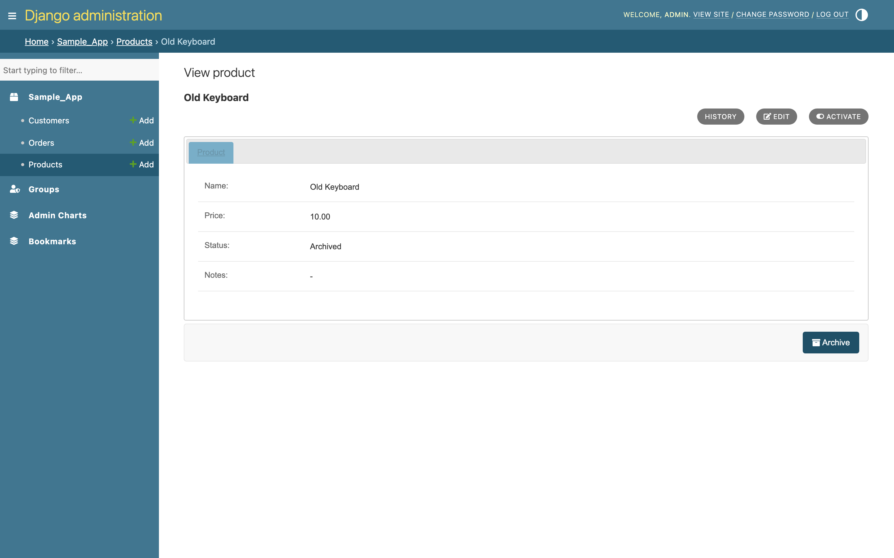
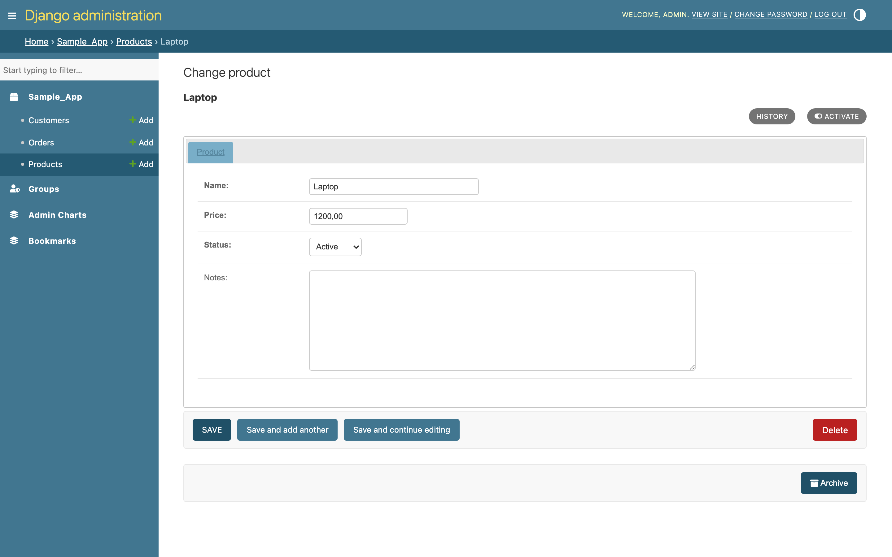
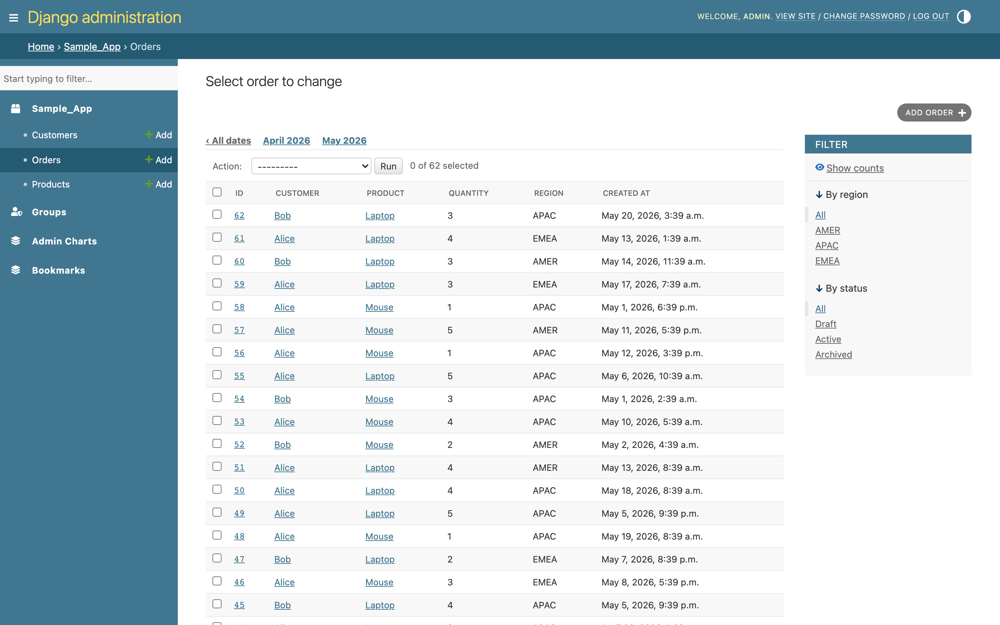
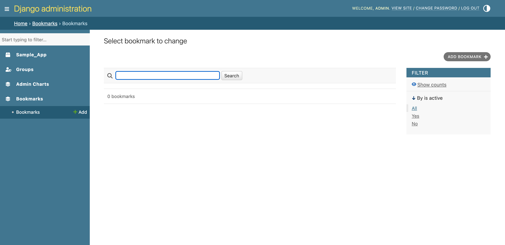
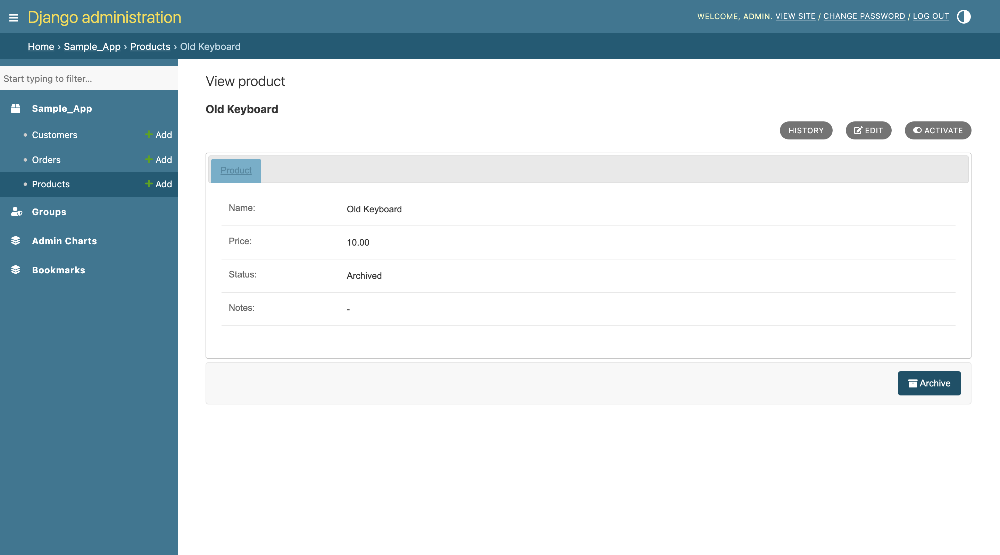
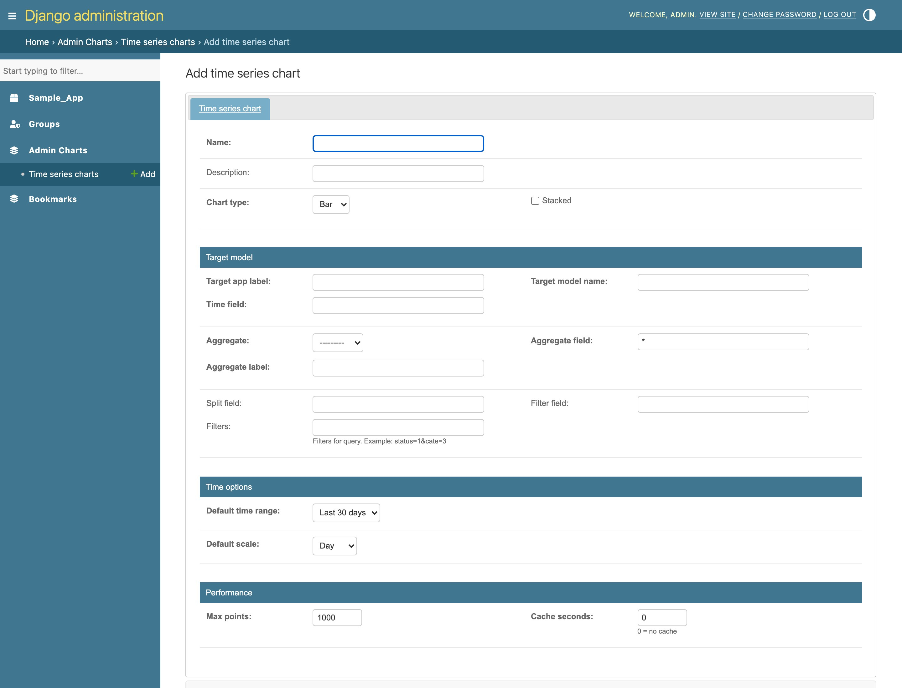
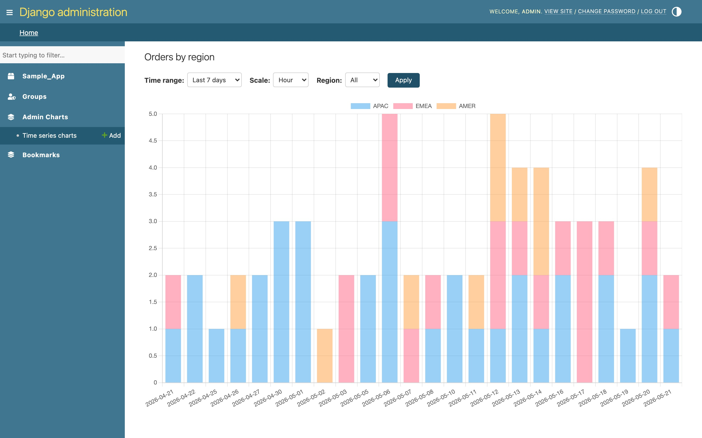

# django-admin-extended

Enhance UI/UX of the Django admin — view/edit/add modes, object-tool buttons, tabbed inlines, auto-registration, custom table pages, bookmarks, and database-driven time-series charts.

- **Django 5.2 LTS / Django 6.0** on **Python 3.12 / 3.13**
- Typed (`py.typed`), `mypy --strict`, `ruff`-linted, tested on a Python × Django matrix
- No URL configuration required — works by overriding admin templates

## Features

- **View / Edit / Add page modes** — change pages open read-only by default; users opt in to edit via the object-tools strip. Per-mode field visibility with `view_only_fields` / `edit_only_fields` / `superuser_only_fields`.
- **Object tools** — `@object_tool` decorator turns any admin method into a button on the change form or change list. GET / POST methods, FontAwesome icons, per-tool permission checks.
- **Display helpers** — `html_img`, `html_link`, `html_color`, `html_json` for list/detail columns, plus automatic FK-to-link rendering in `list_display`.
- **Auto-registration** — `DefaultModelAdmin` builds `list_display` / `list_filter` / `select_related` from the model; `auto_register()` registers every model in every non-Django app.
- **Tabbed inlines** — render inlines as tabs instead of stacked sections.
- **Custom table pages** — `CustomTableAdminPage` replaces a model's changelist with a fully custom HTML table backed by a `TableData` dataclass.
- **Bookmarks** *(optional sub-app)* — pin admin or external URLs to the top of the sidebar; cached with signal-based invalidation.
- **Time-series charts** *(optional sub-app)* — define charts in the admin (bar / line, stacked, split series, filters, scales). No chart code needed; values are aggregated from any model.
- **Sidebar app/model ordering + per-app icons** via `ADMIN_EXTENDED` settings.

## Installation

```bash
pip install "git+https://github.com/cuongnbms/django-admin-extended.git@v6.0.0"
```

```python
# settings.py
INSTALLED_APPS = [
    'admin_extended',                  # required
    'admin_extended.bookmarks',        # optional — bookmark sidebar
    'admin_extended.charts',           # optional — time-series charts
    'fontawesomefree',                 # required — bundles FontAwesome 5 static files
    # ... django.contrib.admin, auth, contenttypes, sessions, messages, staticfiles
]
```

Run `python manage.py migrate` if you added the `bookmarks` or `charts` sub-apps.

## Quickstart

```python
from admin_extended.core import ExtendedModelAdmin
from admin_extended.display import html_color, html_link
from admin_extended.display.html import SUCCESS, ERROR
from admin_extended.object_tools import object_tool
from django.contrib import admin, messages
from django.http import HttpResponseRedirect
from django.urls import reverse


@admin.register(Order)
class OrderAdmin(ExtendedModelAdmin):
    list_display = ('id', 'customer', 'status_badge', 'invoice_link')
    view_only_fields = ('total',)
    edit_only_fields = ('internal_notes',)
    change_form_tools = ('send_invoice',)
    tabbed_inlines = True

    def status_badge(self, obj):
        return html_color(obj.get_status_display(),
                          SUCCESS if obj.is_paid else ERROR)

    def invoice_link(self, obj):
        return html_link(obj.invoice_url, title='Open')

    @object_tool(label='Send invoice', icon='fas fa-envelope')
    def send_invoice(self, request, object_id):
        order = self.get_object(request, object_id)
        # ... do work ...
        messages.success(request, f'Invoice sent for #{order.pk}')
        return HttpResponseRedirect(
            reverse('admin:shop_order_change', args=[object_id])
        )
```

## Configuration

All keys optional; defaults shown.

```python
ADMIN_EXTENDED = {
    'MENU_APP_ORDER': [],          # list[str]: sidebar app ordering by app_label
    'MENU_MODEL_ORDER': [],        # list[str]: model ordering within an app
    'APP_ICON': {},                # {'shop': 'fas fa-shopping-cart', ...}
    'DEFAULT_APP_ICON': 'fas fa-layer-group',
    'TABBED_INLINES': True,
    'AUTO_RAW_ID_FIELDS': False,
    'BOOKMARK_CACHE_SECONDS': 60,
}
```

Settings are read lazily via `admin_extended.conf.settings`, so `override_settings` works in tests.

## Screenshots

| | |
|---|---|
|  |  |
| View mode (read-only by default) | Edit mode (`?edit=1`) |
|  |  |
| Custom change-list object tools | Sidebar bookmarks |
|  |  |
| Change-form object tools | Custom-styled tools |
|  |  |
| Define a chart in the admin | Rendered chart with filters |

## Using with coding agents

[`llms.md`](llms.md) is a single-file reference covering every public API, configuration key, and template hook in this package — formatted for LLM consumption.

Point Claude Code, Cursor, Copilot, or any other coding agent at the version-matched copy:

```bash
curl -O https://raw.githubusercontent.com/cuongnbms/django-admin-extended/v6.0.0/llms.md
```

This avoids the agent hallucinating outdated v5-style APIs or invented setting keys.

## Development

```bash
pip install -e ".[dev]"
pytest                  # full test suite
tox                     # Python 3.12/3.13 × Django 5.2/6.0 + lint + type + build
python -m build         # sdist + wheel
```

See [`CONTRIBUTING.md`](CONTRIBUTING.md) for the contribution workflow.

## Compatibility & migration

v6 is a complete re-architecture with no automatic upgrade path from v5.x. See [`CHANGELOG.md`](CHANGELOG.md) for the full v5 → v6 rename table and breaking changes.

## License

MIT — see [`LICENSE`](LICENSE).
